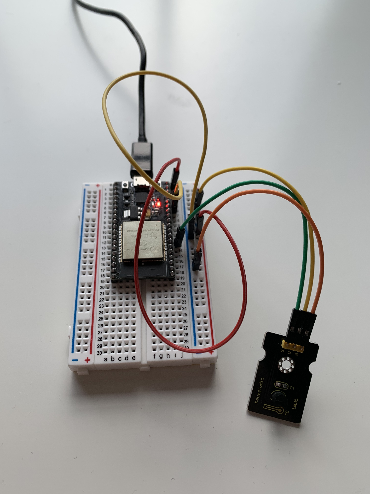

# weather-station

This project was done in the Fall 2023 semester as the final for my CS410 capstone course at UMass Boston. I worked on this project on a team of three and my contributions included the code running the ESP32, and reworking much of the front end java program to be compatible.

A weather app which displays the temperatures recorded over the last eight hours. An ESP32 with a temperature sensor uses the AtSign protocol to transmit weather data to a Java application.

# weather-station example
- You can find a video demonstration of this project [here](https://youtu.be/z5ceh4ug2UM).

# Code Documentation
- Documentation for all of the classes and functions used in this project can be found [here](./code_documentation.md).

# weather-station installation tutorial
## 1. Prerequisites
- Download [VSCode](https://code.visualstudio.com/download)
- Get 3 [atSigns](https://my.atsign.com/go) and their `.atkeys` files. (A video tutorial is available [here](https://youtu.be/8xJnbsuF4C8))
- Get an [ESP32](https://www.espressif.com/en/products/modules/esp32) and a USB-A to micro-USB cable data cable to connect it to your computer.
## 2. Download Code
- Open a command prompt or terminal program and clone the git repository with the command:

```git clone https://github.com/Colin-Wa/weather-station-project.git```
- Open the folder that contains the repository in Visual Studio
## 3. Set up ESP32
- Wire the Keyestudio LM35 to the ESP32 on GPIO32. The final product should look like this:



## 4. Make Adjustments
- Open the `constants.h` file and input your own wifi information
- In both the `java_demo/keys` and `weather_station/data` folder upload your three `.atkey` files
- In `java_demo/demo/src/main/java/com/example/App.java` and `weather_station/src/main.cpp` file, update the three atsign strings `esp_sign`, `java_sign`, and `save_sign` to be the names of your atsigns.
## 5. Upload Code to ESP32
- Open Visual Studio Code
- Go to the `Extensions` tab on the left side of the window
- Search for the extension `PlatformIO` and press `Install`
- Click on the `PlatformIO` tab on the left side of the window
- Select `Pick a folder` option in the window that appears in the `Project Tasks` tab
- Select the `weather_station` file included in the repository
- Click on the `PlatformIO` tab on the left side of the window
- Click `Clean All`, then `Build`
- Place the ESP32 into upload mode
- Press `Upload and Monitor` in the PlatformIO window 
## 6. Start Java Application
- Right click the `App.java` file in the `java_demo` folder and select `Run Code`
- A java application should pop up and the data should begin streaming in from the ESP32


